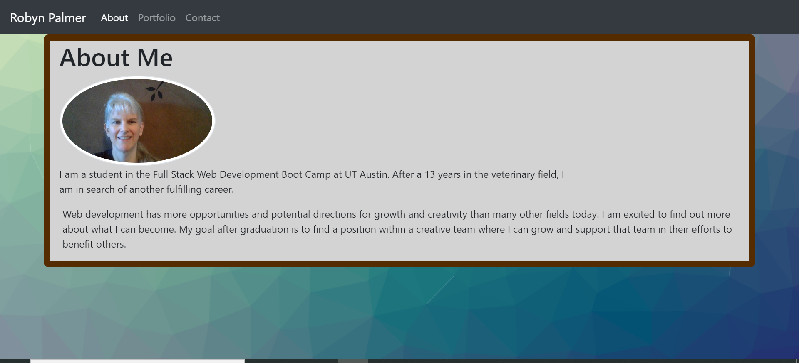
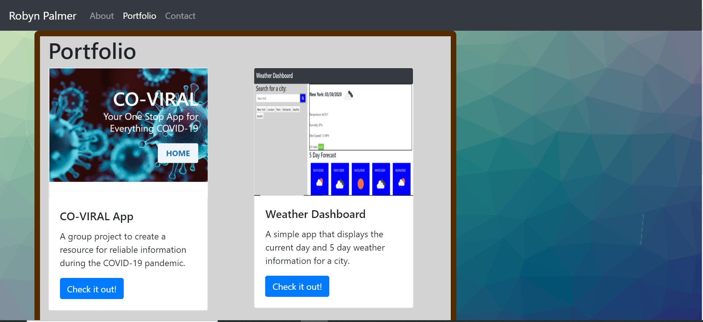
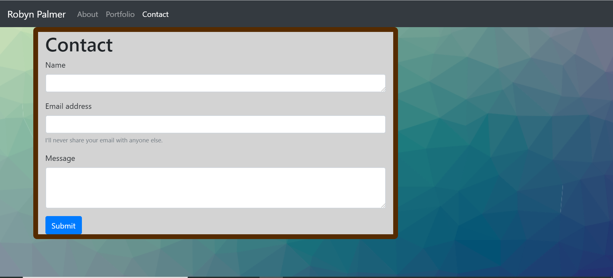

# Homework2
# Unit 02 CSS and Bootstrap Homework: Responsive Portfolio

For this assignment, I created a simple portfolio website using Bootstrap with Responsive Design.  The site contains:
* an About Me page with my brief story and goals
* a Portfolio page showing items I created in this course, plus an outside interest
* a Contact page for receiving the name, email and message from interested parties

## Requirements Completed

* Functional, deployed application

* GitHub repository with README describing the project

* Navbar consistent on each page, with links to Home/About, Contact, and Portfolio pages

* Functional links

* Semantic html

* Used W3C Validator to ensure valid and correct HTML

* Personalized information

* Bootstrap components and grid system

## Page Screenshots

### About

### Portfolio

### Contact

